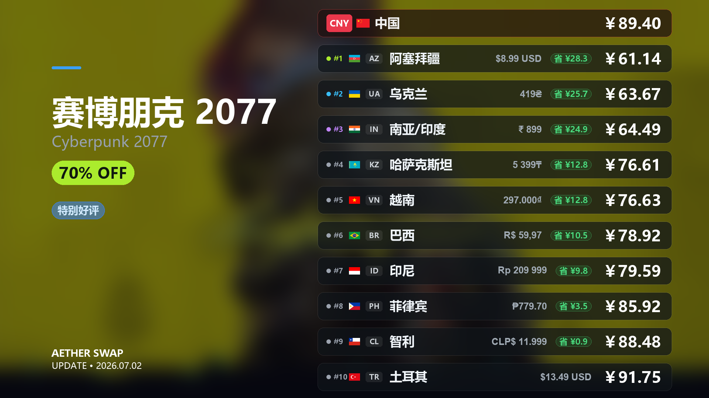

<div align="center">


<h1>⚗️ AetherSwap</h1>

<p><strong>全自动、零代码配置的 Steam 低价余额助手</strong><br>跨区购买 · 行情分析 · 数据复盘 · 全可视化控制台</p>

[](https://github.com)
[](https://python.org)
[](https://fastapi.tiangolo.com)
[](LICENSE)
[](https://github.com)
[](https://github.com)

<p>
  <a href="#-核心功能">功能亮点</a> ·
  <a href="#-快速开始">快速开始</a> ·
  <a href="#-策略中心使用教程">策略中心</a> ·
  <a href="#-工作原理">工作原理</a> ·
  <a href="#%EF%B8%8F-进阶配置">进阶配置</a> ·
  <a href="#-常见问题-faq">常见问题</a> ·
  <a href="#-参与贡献">参与贡献</a> ·
  <a href="#-免责声明">免责声明</a>
</p>

<br>

<br><br>

> 从选品→下单→上架→确认，全程 **99% 无人工干预**；  
> 每笔交易的成本与收益被永久记录，折扣率与盈亏一目了然；  
> 选品与定价基于 **变异系数(CV)、趋势拟合(R²)** 等数学模型，而非靠感觉。

</div>

> [!NOTE]
> **💡 项目定位与预期管理**
> 本项目旨在**为新手降低“倒余额”门槛，为老手节省时间**。
> 请注意，本程序并非专门的套利工具，也不是万能的无风险低价获取余额的神器。自动购买的饰品在经历 7 天（或数天）的交易冷却期后，其市场表现大部分情况下会趋于您所期望的余额价格。但这并非绝对保证，7 天冷却期结束后的实际折扣比例**有可能上升，也有可能下降**。
> **如果您的目的是在短时间内快速获取余额，本工具并不适合您。**

---

## ✨ 核心功能

### 🌌 直观丝滑的全局仪表盘

告别枯燥的命令行与繁杂的 JSON 配置！系统提供了一个直观、美观且响应丝滑的 Web 前端仪表盘（Dashboard）。所有运行状态、行情看板与系统设置均可在图形界面完成，零代码门槛，让你真正享受现代化的掌控体验。

<div align="center">
  
  <br>
  <sup>▲ 图：响应式现代化 Web 仪表盘主页</sup>
</div>

### 🤖 几乎全自动的倒余额流程

从 **选品 → 下单 → 入库 → 上架 → Steam Guard 确认**，整条链路无需人工守候。  
桌面环境可通过内嵌浏览器完成登录与 Cookie 提取；无桌面 Linux 服务器会自动降级为手动 Cookie 流程。绑定移动令牌密钥（`identity_secret`）后，商品上架的二次确认也由程序自动签署。

### 📐 基于数学模型的智能选品与定价

不靠感觉，不靠经验，只靠数据：
- **变异系数 (CV)**：量化价格波动幅度，自动排除价格剧烈震荡的高风险品
- **趋势拟合度 (R²)**：拟合历史价格线性趋势，识别持续下跌或走势紊乱的冷门品  
- **参考价计算**：根据 Steam 寄售深度与历史成交数据，动态选取最优上架价格，而非简单挂最低价

### 📈 实时行情与大盘追踪

系统支持实时追踪现有饰品折扣状态以及大盘市场变动，让你对市场趋势一目了然，帮助你捕捉最佳交易时机。

<div align="center">
  
  <br>
  <sup>▲ 图：实时追踪现有饰品折扣状态以及市场变动</sup>
</div>

### 📜 历史饰品数据深度分析

系统提供了深度的历史饰品数据分析功能，支持复盘特定饰品在长期时间线上的价格走势、成交量变动及盈亏表现，通过回溯历史数据帮助你进一步优化选品策略。

<div align="center">
  
  <br>
  <sup>▲ 图：饰品历史价格跳动与成交分析</sup>
</div>

### 🎮 Steam 游戏折扣获取与动态排序

不仅是饰品倒卖，内置实用的 Steam 商店游戏折扣抓取助手：
- **实时折扣拉取**：一键批量获取 Steam 平台当前打折游戏的数据。
- **多维动态排序**：支持按折扣力度、玩家好评率、历史最低价（史低）等维度进行排序与筛选，方便在倒出 Steam 余额后快速寻找高性价比的消费目标。

<div align="center">
  
  <br>
  <sup>▲ 图：折扣雷达——按好评率与降价幅度动态排序的 Steam 游戏列表（图片预留位）</sup>
</div>

### 🎨 一键生成高质量游戏折扣分享卡片

在游戏折扣面板中，**右键点击**任意游戏卡片，即可一键生成 1920×1080 的高清专属折扣分享卡片：

<div align="center">
  
  <br>
  <sup>▲ 图：赛博朋克 2077 折扣分享卡片示例（右键游戏卡片 → 生成高质量折扣分享卡片）</sup>
</div>

---

### 📊 完整的进销存数据分析

每一笔交易都被永久记录：购入成本、上架价格、最终成交额、实际获得的 Steam 余额，以及综合折扣比率，全部可在数据面板以图表形式呈现。你能清楚地知道每一分钱花在哪、赚了多少。

<div align="center">
  
  <br>
  <sup>▲ 图：直观的盈亏柱状图与综合余额转化率汇总看板（图片预留位）</sup>
</div>

---

### 其他功能（含安全与网路保护）

| 功能模块 | 描述 |
|---|---|
| 🛡️ **Steam 令牌获取与验证** | 内置 Steam 移动令牌（Steam Guard）生成与管理模块，支持提取令牌密钥后在控制台直接生成两步验证码（2FA），无需频繁掏出手机；集成自动确认交易功能，彻底解放双手 |
| � **智能代理池中转** | 针对 Steam 严格的风控与区域限制，内置强大的代理池管理（支持自定义长效静止 IP 及 Webshare 自动轮换动态 IP），防止同 IP 频繁请求导致的社区封禁或红信 |
| �🎨 **Web 控制台** | 现代化可视化界面，零代码完成所有配置，实时掌控运行状态 |
| 🔑 **内嵌 Steam 登录** | 直接在面板输入账号，自动完成登录与 Cookie 提取，无需手动抓包 |
| 🔔 **多渠道消息推送** | 内置 PushPlus 微信推送 + 邮件预警，重要事件即时通知 |
| 🔒 **一键出厂重置** | 彻底清理代理、令牌、数据库、日志等全部隐私数据，安全迁移无忧 |

---

## 🚀 快速开始

### 环境要求

- **Python**: 3.10 或更高版本（[下载](https://www.python.org/downloads/)）
- **操作系统**: Windows 10/11（推荐）、带桌面环境的 Linux，或无桌面 Linux 服务器
- **网络**: 需要能够正常访问 Steam 社区

> [!IMPORTANT]
> **国内用户必读：** 由于网络限制，运行前请务必开启 **Steam 加速器**（如 [Steam++/Watt Toolkit](https://steampp.net/)、加速器等），否则程序将无法正常连接 Steam 社区，导致登录失败或行情数据拉取超时。

### 安装步骤

**第 1 步：克隆项目**

```bash
git clone https://gitee.com/vexed-wilson/AetherSwap.git
cd AetherSwap
```

**第 2 步：安装依赖**

```bash
# 二选一：桌面/本地运行
pip install -r requirements.txt -i https://pypi.tuna.tsinghua.edu.cn/simple

# 二选一：无桌面 Linux 服务器（避免安装 pywebview）
pip install -r requirements-server.txt -i https://pypi.tuna.tsinghua.edu.cn/simple

# 安装 Playwright 浏览器（Linux 服务器推荐 --with-deps）
python -m playwright install chromium
# Linux 服务器：
python -m playwright install --with-deps chromium
```

**第 3 步：启动程序**

```bash
python run.py
```

程序启动后将自动弹出 Web 控制台，按照首页的**「快速开始」**卡片引导完成配置即可。

#### 本地桌面与服务器模式

`python run.py` 会自动判断运行环境：

- 有桌面环境时进入 **desktop 模式**，绑定 `127.0.0.1:28472` 并尝试打开本地窗口/浏览器。
- 无桌面 Linux 或服务进程中进入 **server 模式**，绑定 `0.0.0.0:28472`，需要用外部浏览器访问。
- 首次非交互运行时需要先确认免责声明，可在确认已阅读后设置 `AETHERSWAP_AGREE_DISCLAIMER=1`。

常用环境变量：

```bash
# 强制服务器模式
set AETHERSWAP_MODE=server        # Windows PowerShell 可用 $env:AETHERSWAP_MODE="server"
export AETHERSWAP_MODE=server     # Linux/macOS

# 修改监听地址和端口
set AETHERSWAP_HOST=0.0.0.0
set AETHERSWAP_PORT=28472

# 非交互服务启动时跳过免责声明输入
set AETHERSWAP_AGREE_DISCLAIMER=1
```

如果启动时报 `cannot import name 'Sentinel' from 'typing_extensions'`，说明本机 `typing_extensions` 版本过旧，请执行：

```bash
python -m pip install --upgrade typing_extensions
# 或重新安装项目依赖
python -m pip install -r requirements.txt
```


### 引导流程（约 3 分钟）

```
打开控制台 → 填写手机令牌密钥 → 添加 Steam 账号并验证 → 启动自动任务 🎉
```

1. 观察首页**「快速开始」**待办卡片，逐项完成配置
2. 在【系统设置】中填写 `shared_secret`、`identity_secret` 及通知 Token
3. 在【账号管理】中添加 Steam 账号，点击「验证」自动完成模拟登录
4. 返回首页，点击**「启动任务」**，坐等余额入账 🚀

---

## 🧭 策略中心使用教程

策略中心用于管理自动购入和自动出售的交易决策。现在交易相关参数不再混在设置页里，设置页主要保留账号、通知、代理、刷新、系统等全局配置；具体买什么、怎么买、何时卖、如何定价，请进入左侧导航的【策略中心】。

### 1. 三个工作区

顶部可以切换：

- **购入策略**：决定候选饰品如何过滤、如何校验 Buff/Steam 价格、如何做历史稳定性和采购上限保护，最后是否进入 Buff 锁单付款流程。
- **出售策略**：决定库存饰品如何过滤、同名在售上限、Steam 定价、趋势等待、利润比例保护，最后是否自动上架。
- **模块管理**：查看内置模块和用户导入模块；也能查看声明式模块可读取的数据字段、可用比较操作符和运行阶段。

### 2. 系统策略和自定义策略

- 系统预设策略的模块结构只读，保证默认流程始终可恢复；模块参数可以直接编辑并保存。
- 系统预设策略支持“恢复默认”，会把所有模块参数重置为内置默认值并保存到配置。
- 如果想调整系统策略的模块增删、启用状态或排序，请先点击复制，生成自定义策略后再编辑。
- 自定义策略可以保存、删除、导入、导出和启用。
- 启用策略前会显示与当前启用策略的差异摘要；启用自定义策略前请先使用“模拟运行”确认模块结果。

### 3. 模块编辑规则

策略由一串模块组成。每个模块都有类型、参数、依赖和互斥限制。

- 固定模块不能删除，避免用户把流程删到无法运行。
- 非固定模块支持添加、删除、启用/禁用和长按拖拽排序。
- 出售策略的基础库存校验和上架动作会固定保留；定价核心可以在“价格墙定价”和“墙+断层一体定价”之间替换，添加新定价核心时会自动移除互斥模块。
- 参数可以直接在右侧/下方参数面板编辑，保存时会校验类型、范围和枚举值。
- 模块数量有限制；重复添加、依赖缺失、顺序错误、互斥冲突都会被阻止。
- 模拟运行是 dry-run，不会触发 Buff 锁单、付款等待或 Steam 上架。

### 4. 用户自定义模块

当前版本开放的是**安全声明式模块**，而不是任意代码执行。

声明式模块 manifest 示例：

```json
{
  "id": "custom.sell.price_floor",
  "name": "出售底价保护",
  "module_kind": "declarative",
  "strategy_types": ["sell"],
  "uses_modules": ["pricing.steam_wall_price"],
  "stage": "sell.listing_guard",
  "conditions": [
    {
      "left": "outputs.pricing.steam_wall_price.list_price",
      "op": "gte",
      "value": 15
    }
  ],
  "fail_status": "reject",
  "message": "上架价低于自定义底价，跳过出售"
}
```

常用字段说明：

| 字段 | 说明 |
|---|---|
| `id` | 模块唯一 ID，不能覆盖内置模块 |
| `module_kind` | 当前可启用值为 `declarative` |
| `strategy_types` | `buy` 或 `sell`，也可以同时声明 |
| `stage` | 运行阶段；购入为 `buy.candidate_guard`，出售为 `sell.listing_guard` |
| `uses_modules` | 声明依赖哪些前置模块输出，系统会校验顺序 |
| `conditions` | 条件列表，支持 `eq/ne/gt/gte/lt/lte/contains/in/exists/between` 等操作 |
| `fail_status` | 条件不满足时返回 `reject`、`wait`、`pass` 或 `error` |
| `message` | 模拟结果和日志中显示的原因 |

声明式模块能读取 `item`、`buy_record`、`listing`、`config` 和前置模块 `outputs`。例如：

- `item.daily_volume`
- `item.min_price`
- `listing.list_price`
- `buy_record.price`
- `outputs.buy.steam_sell_depth.estimated_ratio`
- `outputs.pricing.steam_wall_price.list_price`

带有 `code`、`source`、`entrypoint`、`command` 等字段的外部代码模块只会登记展示，不会执行，也不能加入启用链。这是为了避免用户代码直接影响锁单、付款、上架等高风险动作。

### 5. 推荐使用流程

1. 在【策略中心】选择购入或出售策略。
2. 如果只改系统策略参数，可以直接编辑并保存；如果要调整模块顺序、启用状态或增删模块，请先复制为自定义策略。
3. 调整模块参数，或在自定义策略中调整模块顺序和启用状态。
4. 点击“模拟运行”，查看每个模块的通过、拒绝、等待、动作跳过原因。
5. 确认没有未知模块、禁用模块或依赖错误后保存。
6. 启用策略，并小范围观察真实日志。

---

## ⚙️ 工作原理

AetherSwap 由两条后台 Pipeline 协同驱动：

### 采买 Pipeline

```
SteamDT 行情接口 → 折扣筛选 → 稳定性分析(CV/R²) → 防呆校验 → Buff 自动下单
```

1. **实时选品**：对接 SteamDT 接口，拉取综合折扣最优的饰品列表
2. **稳定性过滤**：请求 Steam 历史价格数据，计算 `CV`（变异系数）与 `R²`（趋势拟合度），自动剔除高波动品
3. **安全下单**：验证每日限购数量、最低折扣等防呆条件后，在 Buff 自动模拟创建订单

> **支付方式说明**：当前版本仅支持通过 **微信支付** 完成购买结账。支付宝等更多支付方式正在规划中，欢迎关注后续更新。

### 出售 & 数据沉淀 Pipeline

```
库存监听 → 获取 Steam 寄售深度 → 自动上架 → 令牌签名确认 → 交易数据入库
```

1. **库存监听**：智能检测 Steam 新入库饰品，自动触发上架流程
2. **令牌无感确认**：使用 `identity_secret` 自动签署 Steam 商品上架二次确认
3. **数据沉淀**：订单完成后永久记录进销存信息，精确计算每笔余额的实际折损比率

---

## 🔧 进阶配置

账号、通知、代理、刷新、系统等全局参数可在 Web 控制台的【系统设置】中实时调整，**修改立即生效，无需重启**。购入/出售决策相关参数请在【策略中心】中通过模块参数管理。

### 常用参数说明

| 参数 | 默认值 | 说明 |
|---|---|---|
| `stability.days` | `30` | 历史价格回溯天数，天数越长分析越稳健 |
| `stability.cv_threshold` | `0.05` | 波动率上限，调高可买入更多品类（风险同步上升） |
| `stability.r2_threshold` | `0.7` | 趋势拟合度下限，调低可接受更多震荡走势品 |
| `pipeline.max_daily_buy` | - | 每日最大购买金额上限，用于资金风控 |
| `strategies.active_buy_strategy_id` | `system.buy.default` | 当前启用的购入策略 ID |
| `strategies.active_sell_strategy_id` | 自动兼容旧配置 | 当前启用的出售策略 ID |
| `pipeline.sell_strategy` | `4` | 旧版出售策略兼容字段；新版本建议在【策略中心】切换出售策略 |
| `proxy_pool` | - | 自定义代理列表，留空则使用内置 Webshare 自动轮换 |

> **保守策略提示**：默认策略极度保守（宁少赚不亏本）。若想提高买入频率，建议复制系统购入策略后，在【策略中心】调整历史稳定性、最高折扣、卖压保护等模块参数，并先模拟运行。

### 📩 自动化配置：关于“邮箱确认”

在程序的自动抢购与下单流程中，支付完成后的确认环节分为两种模式。这取决于你是否在【系统设置】中配置了邮箱（IMAP）信息：

- **自动化（配置了邮箱）：** 系统在生成支付链接后，如果你扫码完成了付款，交易平台通常会发送一封通知邮件（如含“已确认成功付款”的字样）。系统通过 IMAP 持续监听你的收件箱，一旦捕捉到付款成功的邮件，即可**自动流转**到后续的“提取并核销饰品、提醒卖家发货”等环节。
- **纯手动（未配置或留空）：** 如果你不填写 `email_user` 或 `email_pass`，程序**不会报错或崩溃**，而是自动降级为纯手动确认模式。此时页面和后台日志将进入等待倒计时，你需要**在 5 分钟（即默认的 `email_timeout_seconds=300`）内手动在界面上点击确认已支付**。如果完成付款但未在 5 分钟内给予系统确认指令，系统会将其视为订单超时并跳过该饰品。

> **💡 建议：** 如果你追求尽可能全程挂机和无感体验，建议配置一个专门接收付款通知的邮箱（如开启 IMAP 的 QQ 邮箱 / 网易邮箱等），这将带给你最流畅的半自动化交易流转。

---

## 🏗 项目结构

```
AetherSwap/
├── app/                   # FastAPI 后端核心
│   ├── main.py            # 应用入口 & 路由注册
│   ├── runtime_env.py     # 桌面/服务器模式自动判断
│   ├── strategy_engine.py # 策略中心、模块校验、模拟运行与运行时接入
│   ├── pipeline_steps.py  # 采买 / 出售 Pipeline 逻辑
│   ├── database.py        # SQLModel ORM & 数据库操作
│   ├── routes/            # FastAPI 路由，包含策略中心 API
│   └── services/          # 后台任务队列与调度
├── buff/                  # Buff 平台接口封装
├── steam/                 # Steam API & Playwright 自动化
├── steamdt/               # SteamDT 行情数据接口
├── utils/                 # 公共工具（代理、推送、配置等）
├── web/                   # 前端静态文件（HTML/JS/CSS）
├── tests/                 # 单元测试套件
├── run.py                 # 一键启动入口
├── requirements.txt       # 桌面/本地运行依赖清单
└── requirements-server.txt # 无桌面服务器依赖清单
```

---

## 🧪 运行测试

```bash
# 运行全部单元测试
pytest -q

# 运行策略中心专项测试
pytest tests/test_strategies.py -q

# 前端脚本语法检查
node --check web/js/strategies.js web/js/main.js web/js/utils.js
```

---

## 💡 常见问题 FAQ

<details>
<summary><b>Q：报错获取不到历史数据？</b></summary>

请检查steam是否完成登录，历史数据获取需要登录信息用于获取。

</details>


<details>
<summary><b>Q：我只想倒箱子怎么设置？</b></summary>

将销售量过滤参数设置为2000后适当调整参数即可。

</details>

<details>
<summary><b>Q：启动后控制台窗口打不开？</b></summary>

请确认依赖安装无报错。若为端口占用，可设置 `AETHERSWAP_PORT=其他端口`，或直接使用 `python -m uvicorn app.api:app --host 0.0.0.0 --port 其他端口`。

如果报错类似 `cannot import name 'Sentinel' from 'typing_extensions'`，请升级依赖：

```bash
python -m pip install --upgrade typing_extensions
python -m pip install -r requirements.txt
```

</details>

<details>
<summary><b>Q：账号登录失败 / Cookie 提取不到？</b></summary>

请确保当前网络（加速器）能够访问 Steam 社区。若自动登录持续失败，可在【账号管理】中手动填入从浏览器获取的 Cookie 作为备用方案。

</details>

<details>
<summary><b>Q：系统频繁提示"因波动率/斜率放弃购买"？</b></summary>

这是正常的保守行为。若希望增加买入频率，请在设置中将 `cv_threshold` 调至 `0.08`，并降低 `r2_threshold` 至 `0.6` 左右。调整前请充分理解风险。

</details>

<details>
<summary><b>Q：如何部署到 Linux 服务器？</b></summary>

AetherSwap 的 FastAPI 架构完整支持无头 Linux 环境。直接运行：

```bash
pip install -r requirements-server.txt
python -m playwright install --with-deps chromium
AETHERSWAP_MODE=server AETHERSWAP_AGREE_DISCLAIMER=1 python run.py
```

也可以直接运行 Uvicorn：

```bash
python -m uvicorn app.api:app --host 0.0.0.0 --port 28472
```

`python run.py` 会自动判断当前环境：有桌面时打开本地窗口，无桌面 Linux/服务器环境则进入服务器模式并监听 `0.0.0.0:28472`。可通过 `AETHERSWAP_MODE=server|desktop`、`AETHERSWAP_HOST`、`AETHERSWAP_PORT` 覆盖默认行为；首次以非交互服务运行时，确认已阅读免责声明后可设置 `AETHERSWAP_AGREE_DISCLAIMER=1`。

再通过外部浏览器访问服务器 IP 即可。**强烈建议配置 Nginx 反向代理与访问鉴权，不要将管理面板直接暴露在公网。**

</details>

<details>
<summary><b>Q：策略中心里的用户模块可以直接执行代码吗？</b></summary>

不可以。当前版本只允许启用 `module_kind: "declarative"` 的安全声明式模块；它只能读取上下文和前置模块输出，再用白名单操作符做判断。带 `code`、`source`、`entrypoint`、`command` 等字段的外部代码模块只会登记展示，不会执行，也不能加入启用链。

</details>

<details>
<summary><b>Q：Buff Cookie 过期了怎么办？</b></summary>

在 Web 控制台的【账号管理】中点击「重新登录」。有桌面环境时系统会拉起内嵌浏览器完成重新授权；无桌面服务器会自动切换为手动 Cookie 输入流程。

</details>

---

## 🤝 参与贡献

欢迎任何形式的贡献！请遵循以下流程：

1. **Fork** 本仓库
2. 基于 `main` 创建你的特性分支：`git checkout -b feature/my-awesome-feature`
3. 提交你的更改：`git commit -m 'feat: add some awesome feature'`
4. 推送到远端：`git push origin feature/my-awesome-feature`
5. 发起一个 **Pull Request**

提交 Bug 报告或功能建议，请尽量附上完整日志。

---

## 💬 社区 & 联系

如果你在**余额倒卖方面有丰富经验**，欢迎加入测试、反馈选品策略或参数调优建议——你的实战经验将直接帮助改进算法。

> 📱 **微信**：`13738064065`  
> 加好友时请备注 **AetherSwap** 以及**来访目的**，

---

## 🗺 Roadmap

> 以下为计划中的功能，欢迎通过 Issue 或 PR 参与建设！

- [ ] **更多交易平台接入**
  - [ ] C5Game 平台对接
  - [ ] IGXE 平台对接
  - [ ] 悠悠有品平台对接
- [ ] **更多支付方式**
  - [x] 微信支付
  - [ ] 支付宝支付
- [ ] **移动端 / 响应式 UI 适配**
- [ ] **Docker 一键部署支持**
- [ ] **多账号并发任务调度**

---

## 📄 开发者说明

- **后端栈**：`Python 3.10+` · `FastAPI` · `SQLModel (SQLite)` · `Playwright`
- **前端栈**：原生 `HTML / JS / CSS`（无框架依赖）
- **并发机制**：异步 + 多线程融合的后台 Task Queue（`app/services/workers`）
- **扩展性**：高内聚、低耦合的模块化设计，接入 C5、IGXE 等其他平台仅需添加对应 API 封装层

---

## ⚠️ 免责声明

> **在使用、克隆或下载本项目前，请务必仔细阅读本免责声明。您的任何使用行为（包括但不限于下载、安装、运行、修改及分发本项目代码）均被视为对本声明全部条款的无条件知晓、认可及接受。若您不同意本声明的任何内容，请立即停止使用本项目并删除所有相关文件。**

1. **学习与研究目的**：本项目完全开源且免费，仅作为 Python 自动化操作、数据爬取、全栈架构及数学模型应用的**学习、交流与技术验证**之用。项目本身并未集成任何用于破解、攻击或恶意破坏第三方平台的基础设施。**严禁**将本项目或其任何衍生版本用于任何非法、违规或违反第三方平台（如 Steam、网易 Buff 等）《用户协议》及《服务条款》的商业或黑产行为。因违规使用导致的任何法律红线触碰，均由使用者自行承担全部法律及连带责任。
2. **账号风控与封禁风险**：Steam 及相关饰品交易平台针对“使用自动化脚本、API 滥用、机器批量操作”等行为持有严格的零容忍政策及风控机制。使用本项目进行实盘交易，存在**账号被红信、API 封禁及资产被永久冻结的风险**。使用者应当充分了解此风险，做好风控隔离处理（如使用独立代理、限制请求频率等）。**因使用本项目导致的任何账号限制、封禁或资产清零，本项目及开发者（含代码贡献者）概不负责，不承担任何形式的赔偿或连带责任。**
3. **市场波动与资金损失风险**：虚拟饰品市场受多方因素影响（包括但不限于平台政策变更、游戏更新、外汇波动等），存在极大的市场不确定性与暴雷风险。本项目内置的任何算法、趋势拟合（如 CV、R²）及数据分析功能，仅基于历史数据进行学术性质的模型推演与展示，**不构成任何形式的投资、购买或理财建议**。实际运行中的任何异常（如：网络延迟、接口报错、算法偏差或不可预见的黑天鹅事件）均可能导致高挂低售或财产损失。**由此引发的一切直接或间接的经济损失，开发者免责。**
4. **数据隐私与安全**：本项目在本地运行，涉及敏感信息（如账号 Cookie、移动令牌身份密钥 `identity_secret` 及支付相关参数）均储存于使用者本地设备。使用者需自行妥善保管上述敏感数据。因个人保管不当、设备中毒、代理泄露或服务器被入侵导致的隐私泄露或财产损失，开发者不承担任何责任。
5. **严禁商业滥用与倒卖**：本项目遵循开源协议免费发布，**严禁任何人、工作室或利益团体在未获原作者明确书面授权的情况下，将本项目（包括源代码、衍生修改版本、二次编译封装的二进制程序等）用于商业兜售、代挂收费、知识付费打包或任何变相盈利行为**。对于任何侵权、倒卖或损害开源社区利益的行为，开发者保留依法追究其侵权与不正当竞争责任的权利。
6. **请求频率限制与 DDoS 风险**：因防范恶意滥用与平台风控等安全考量，本项目故意设置并限制了默认的请求频率。如果您擅自更改代码逻辑取消延时保护，或是使用大量代理池进行高并发、无限制的请求，导致被官方服务器认定为恶意爬虫甚至 DDoS 攻击，本项目及开发者概不负责，均由使用者自行承担全部法律责任及封禁后果。

**【最终声明】本项目按“原样”提供，不带有任何明示或暗示的担保。开发者不对代码的准确性、可靠性或适用性做任何承诺。一切使用后果由操作者本人全权负责。**

---

<div align="center">

如果 AetherSwap 对你有帮助，欢迎点个 **⭐ Star** 支持一下！

Made with ❤️ for the Steam community

</div>
